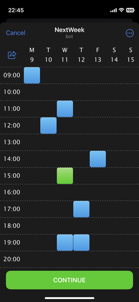
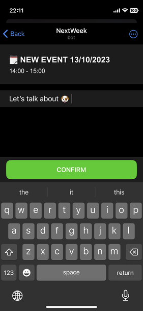

# NextWeekTWA

Telegram Mini App that implements event booking flow on a week 
and provides ability to share your week with a friend/customer, so he can book an hour.




### Prerequisites
* [Docker](https://www.docker.com/) installed on your OS,
* [Telegram](https://telegram.org/) account.

### Tech stack overview
* [python-telegram-bot](https://python-telegram-bot.org/) for easy Telegram API access,
* [Django](https://www.djangoproject.com/) & [DRF](https://www.django-rest-framework.org/) on server side,
* [Celery](https://docs.celeryq.dev/) & [Redis](https://redis.io/) for background tasks,
* [React](https://react.dev/) & [CRA](https://create-react-app.dev/) on client,
* [Nginx](https://www.nginx.com/) as reverse proxy and static server,
* [PostgreSQL](https://www.postgresql.org/) as database.

### Features overview

#### Authentication
Authentication implemented with middleware parsing user's 
`initData` [as documented](https://core.telegram.org/bots/webapps#validating-data-received-via-the-mini-app)
sent in `X-Telegram-Auth-Token` header, see `server/bot/middleware.py` 

#### Web App Links
There is a link you can share with a friend: it contains your secret user key and some data, representing a week.
For example: https://t.me/NextWeekTheBot/app?startapp=647C6C-20231010

Having this link, anyone can open your calendar and book an event on it. 

#### Notifications

There are two main role in the booking flow: _event owner_ and _event author_.
Anytime an event created, the bot will send a notification to both. See `server/events/notifications.py`

#### React-friendly [main and back buttons](https://core.telegram.org/bots/webapps#mainbutton)

There is `<Page/> (client/src/common/Page)` React component, providing easy access to button usage like this:
```
<Page
    mainButtonProps={ {
        visible: true,
        text: 'DO SOMETING!',
        onClick: () => doSomething(),
        loading: isLoading
    } }
    backButtonProps={ {
        visible: true,
        to: <your app url>
    } }
>
```
Note that ANY route of your app must be wrapped into this component for correct work: 
it will help you sync current app state with buttons.  

#### Admin pannel

As an administrator, you can use Django's `/admin` to control any app content, 
if your model is registered in `admin.py`.

#### Easy development!
Dev set up is really helpful and includes instant update on code changes (hot reloading) on server and client both 
and also a web console provided by [eruda](https://github.com/liriliri/eruda).

### Configuration
To setup environment variables, classic `.env` file is used. Let's see:
```
# Tunneling: see "Development" section.
DEV_TUNNEL_HOST=<your-unique-subdomain>.serveo.net

# Make it "1" for your production config.
PRODUCTION=0
# This is a host for you website (only required for production).
PRODUCTION_HOST=<yourapp.com>

# For this settings you should create bot follow Telegram's @BotFather instuctions.
TELEGRAM_BOT_TOKEN=<>  # @BotFather /newbot
TELEGRAM_BOT_USERNAME=<>  # @BotFather (also available in /newbot)
TELEGRAM_WEB_APP_NAME=app  # @BotFather /newapp

# Long unpredictable string (see https://djecrety.ir/)
DJANGO_SECRET_KEY=<> 

# PostgreSQL's standart database config.
POSTGRES_DB=database
POSTGRES_USER=user
POSTGRES_PASSWORD=123
POSTGRES_HOST=database
POSTGRES_PORT=5432
```

### Development

Clone this repo to you machine, then create an `.env` file by template:
```
cp template.env .env
```
Open it in your favorite text editor and fill in all `<>`.

Great! Now you need to setup a *tunnel* to `localhost:8765`.

The thing is - unfortunately, you can't test TWA inside it's environment with you app running on `localhost`. 
So, for easy testing purposes we making our `localhost` public (accessable via external network) through a *tunnel*.

There are many solutions for this (https://github.com/anderspitman/awesome-tunneling), 
but here we use https://serveo.net/ - it's easy to set up, stable and free.

```
ssh -R <your-unique-subdomain>.serveo.net:80:localhost:8765
```
It's better to have unique subdomain name: as we saw in **Configuration** section,
you also need to set it in the `.env` file. 
It'll be uncomfortable to change `DEV_TUNNEL_HOST` every time your tunnel shuts down. To use custom subdomain like this,
you will be asked to login - it's just an easy one-time task.

When you tunnel is ready, to start the app in dev mode, just do:
```
docker compose up
```
That's it! The app is running on `8765` port.

Now, if you `/start` your Telegram bot, it'll be able to test the web app.

#### Superuser creation
To access admin panel on `https://<your-unique-subdomain>.serveo.net/admin/` you will need a superuser:
```
docker exec server ./manage.py createsuperuser
```

### Deployment
You can build images on your local machine or set up a CI with commands:
```
export NAMESPACE=<your docker images registry>
export BUILD_VERSION=<your specified incrementing build version>
docker compose -f build.yml build
docker compose -f build.yml push
```
Then, on your production server using the same environment variables and `.env` config:
```
docker stack deploy nw_stack --compose-file deploy.yml
```
